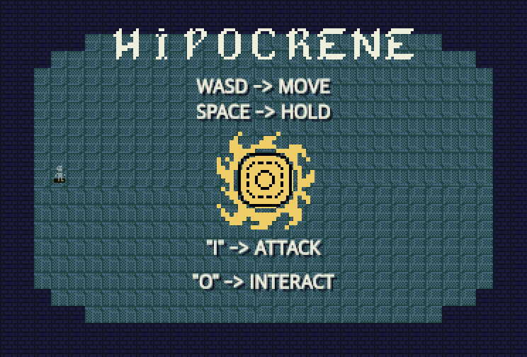
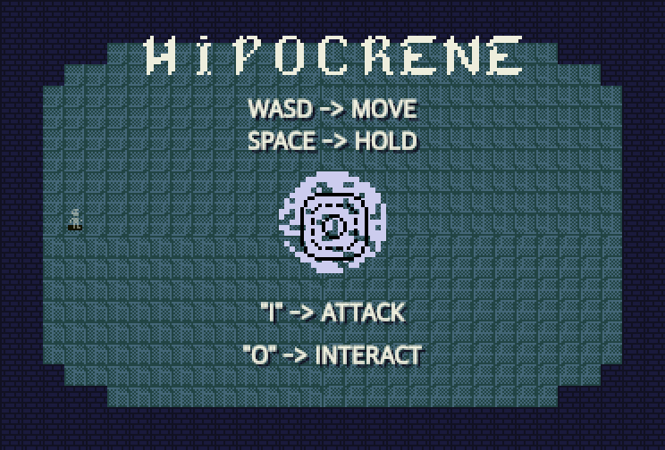
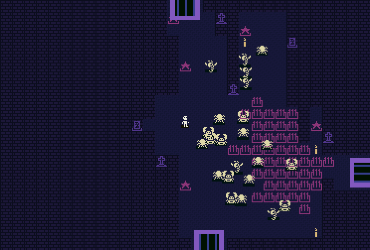
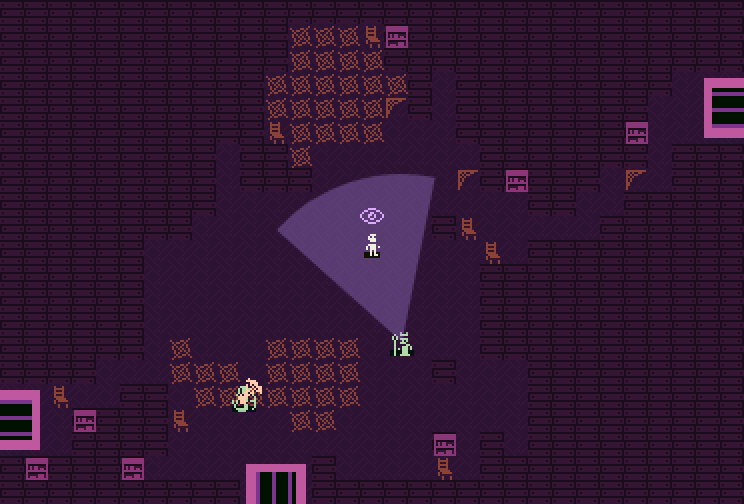
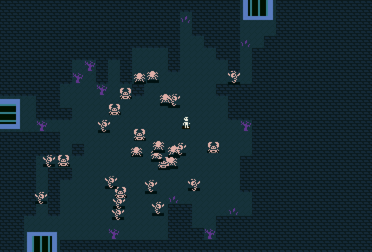

<div align="center">

# 𝕳𝕴𝕻𝕺𝕮𝕽𝕰𝕹𝕰

**A real-time dungeon crawl that fits in a single 9.5 KB HTML file.**

*Two hit points. Six rooms a floor. One skull that really wants you dead.*

 

</div>

---

## ▶ Play

The game is one HTML file with no runtime dependencies and no network. Build it once, then open `dist/index.html` in any modern browser:

```sh
npm ci && npm run build   # or: npm run dev, then visit http://127.0.0.1:8010/dist/
```

| Key | Does |
| :---: | --- |
| **W A S D** / arrows | Walk. Hold two keys to face and strike diagonally |
| **Space** | Plant your feet. Keep turning, stop moving |
| **I** | Attack. Hold to keep swinging |
| **O** | Interact: pick things up, use the exit |
| **R** | Start a fresh run |

You wake beside a ring. Its center holds either a sun or a moon, depending on the night. Step into the middle and the floor gives way.

## 💀 What's down there

 

Every room rolls its own crowd: a mixed bag of creatures, a wall-to-wall **swarm**, or a single dancing **conga line**.

| | Creature | How it gets you |
| :---: | --- | --- |
| 🕷 | **Swarm** | Twenty-odd slow pursuers. Death by crowd |
| 🏹 | **Archers** | Four temperaments: single shot, fan, long-range sniper, rapid fan |
| 💣 | **Kamikaze** | Waddles up, lights a 3×3 square and goes out with it |
| 🎺 | **Conga** | A line that follows its leader's footsteps. Kill the head and the next one leads |
| 🔱 | **Charger** | Winds up, then commits to a straight-line lunge |
| 🐎 | **Horses** | Charge immediately. One is fast, one is… thinking about it |
| 🔮 | **Mage** | Paints a line, a cross or a distant patch on the floor, then sets it on fire |
| 👁 | **Medusa** | Turns its gaze cone after you. Six seconds inside it and the madness lands. Walls are your friend |

Every floor ends in a **boss arena** where the **Skull** waits. Beat it and the floor's landmark rises in the middle of the arena: a *tiny palace*, a *giant mirror*, a *giant mouth*, a *whirlpool*, a *folded doorway*, or one of five others. Step into it to go down.

## ⚔ Things to hit with

Bosses drop the only weapons. A new one replaces the old.

| Weapon | Feel |
| --- | --- |
| **Fist** | Quick jab. Where everyone starts |
| **Needle** | An arrow that flies until it hits a wall |
| **Fang** | Thrown, then it comes back for you |
| **Nunchucks** | A wide forward sweep |
| **Whirlwind** | A ball and chain spun all the way around |
| **One-two** | Jab, then jab again |
| **Trident thrust** | Charge up, then dash through everything in front |
| **Heavy mace** | Lift it overhead, then bring it down |
| **Rune wand** | Casts a mage's spell, but on *them* |

Armor sometimes appears in cleared rooms. Each piece is +1 heart, and it's the only healing there is.

## 🏚 Three kinds of dark



- **Ossuary**: graves and candles, with needle traps that pulse up through the floor.
- **Cistern**: drowned and quiet. That makes the crowds louder.
- **Archive**: bookshelves and cobwebs that grab at your feet.

Every floor reshuffles its layout and palette, and **composes its own song**: a new scale, key, tempo, chord walk and melody each time you go down. There's no score. The song is your souvenir.

## 🗜 How it fits

The jam limit is 10,000 bytes. Hipocrene ships **9,516 bytes**: code, art, music and sound in one self-unpacking HTML page.

- Every sprite is a 1-bit, 12×12 tile from **Urizen**, packed six pixels per character and tinted at runtime.
- All audio is synthesized live from oscillators. There are no sound files.
- The program goes through esbuild, then terser, then [Roadroller](https://github.com/lifthrasiir/roadroller)'s context-mixing compressor. Roadroller's output is packed again with deflate inside a tiny ISO-8859-5 bootstrap.

The full blow-by-blow of every byte saved (and every experiment that didn't pay off) lives in [`docs/SIZE-LOG.md`](docs/SIZE-LOG.md).

## 🛠 Hacking on it

```sh
npm test               # full gameplay, packing and pixel-equivalence suite
npm run build          # writes dist/index.html, dist/game.zip, dist/size-report.json
npm run dev            # serves http://127.0.0.1:8010
```

`dev/play.html` is the development build. It adds a debug bar for picking rooms, enemies and weapons, a pause button, hitboxes and rebinding. Content lives in `assets/content.json`. The runtime is split across `src/room.js`, `src/world.js`, `src/combat.js`, `src/actions.js` and `src/game.js`.

## 🙏 Credits

- Art: [**Urizen 1-bit tileset**](https://vurmux.itch.io/urizen-onebit-tileset) by **vurmux** (CC0).
- Made for the [**10 Kilobytes Jam**](https://itch.io/jam/10-kilobytes-jam-).
